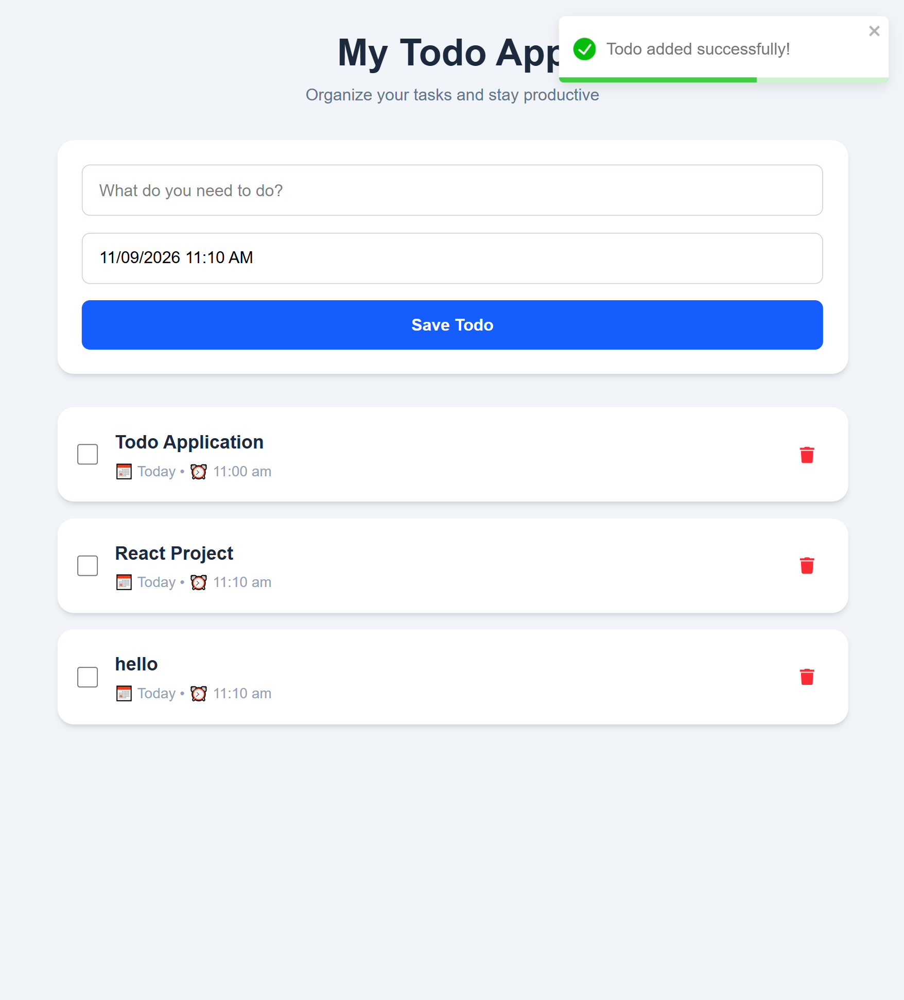

# 📝 Todo Application

A simple and responsive **Todo Application built with React and Tailwind CSS**.
This project helps demonstrate how React state, components, browser local storage, third-party libraries, and user interactions can be combined to build a practical application.

## 📸 Screenshots


## 🚀 Features

* ➕ Add new todos
* 🗑️ Delete todos
* ☑️ Mark todos as completed
* ~~Completed todos display with a line-through~~
* 📅 Select todo date using **React DatePicker**
* 📆 Display **Today** when the todo is scheduled for the current date
* 💾 Store todos in **Local Storage**
* 🔔 Show notifications using **React Toastify**
* 📱 Responsive design
* 🎨 Styled using **Tailwind CSS**

## 🛠️ Technologies Used

### Frontend

* **React.js** – Building the user interface and components
* **Tailwind CSS** – Styling and responsive design
* **JavaScript** – Application logic

### Libraries

* **React DatePicker** – Selecting date and time
* **React Toastify** – Displaying toast notifications
* **React Icons** – Adding icons to the interface

### Browser API

* **Local Storage** – Persisting todos in the browser

## 📂 Project Structure

```text
src/
│
├── components/
│   ├── TodoForm.jsx
│   ├── TodoItem.jsx
│   └── TodoList.jsx
│
├── App.jsx
├── main.jsx
└── index.css
```

## 📅 React DatePicker

The application uses React DatePicker to allow users to select a date and time for their todo.

Example:

```jsx
<DatePicker
  selected={date}
  onChange={(date) => setDate(date)}
  showTimeSelect
  dateFormat="dd/MM/yyyy h:mm aa"
/>
```

## 🔔 React Toastify

React Toastify is used to display notifications when users perform actions.

Examples:

```jsx
toast.success("Todo added successfully!");
toast.success("Todo updated successfully!");
toast.info("Todo marked as completed!");
```

## 💾 Local Storage

Todos are stored in the browser's Local Storage so that they remain available after refreshing or reopening the application.

Example:

```jsx
localStorage.setItem(
  "todos",
  JSON.stringify(todos)
);
```

When the application starts, the saved todos can be retrieved using:

```jsx
const savedTodos = localStorage.getItem("todos");
const todos = savedTodos
  ? JSON.parse(savedTodos)
  : [];
```

## 🔄 CRUD Operations

This project demonstrates the basic **CRUD** operations:

| Operation | Feature                              |
| --------- | ------------------------------------ |
| Create    | Add a Todo                           |
| Read      | Display Todos                        |
| Update    | Edit Todo / Change completion status |
| Delete    | Delete Todo                          |

## 🎯 Learning Goals

This project was created to practice and understand:

* React components
* `useState`
* `useEffect`
* Props
* Event handling
* Forms
* Conditional rendering
* Array methods such as `map()` and `filter()`
* Local Storage
* React DatePicker
* React Toastify
* React Icons
* Tailwind CSS
* CRUD operations
* Component-based application structure

## 🔮 Future Improvements

Possible features that can be added later:

* 🔍 Search todos
* 🏷️ Todo categories
* 📌 Priority levels
* 🌙 Dark/light mode
* 📊 Todo statistics
* 🔄 Sort todos by date
* 📅 Filter by Today, Upcoming, and Overdue
* ⚠️ Confirmation before deleting
* 📤 Export todos
* 📥 Import todos
* 🔔 Reminders
* 📱 Improved mobile UI

## 👨‍💻 Author

**Your Name**

This project was created as a React learning project to practice modern frontend development and understand how different React libraries work together.

## 📄 License

This project is open source and available for learning and personal use.
